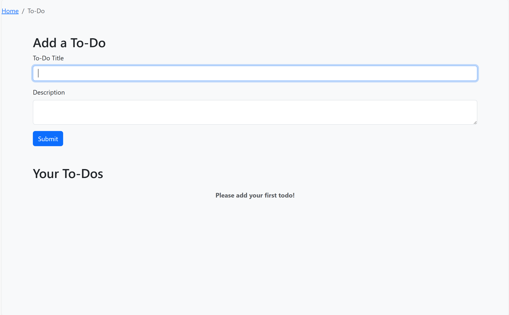
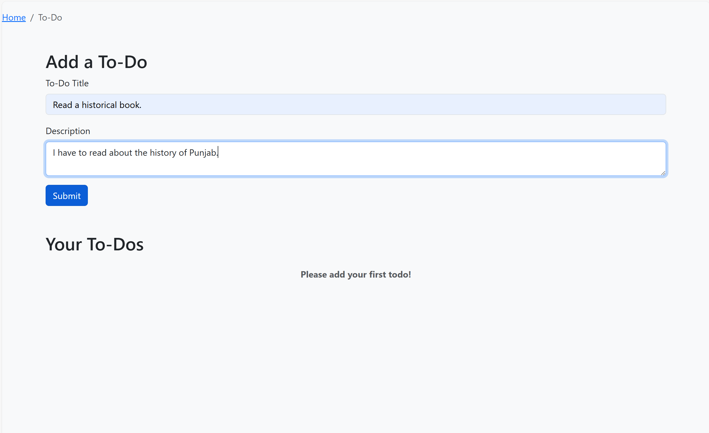
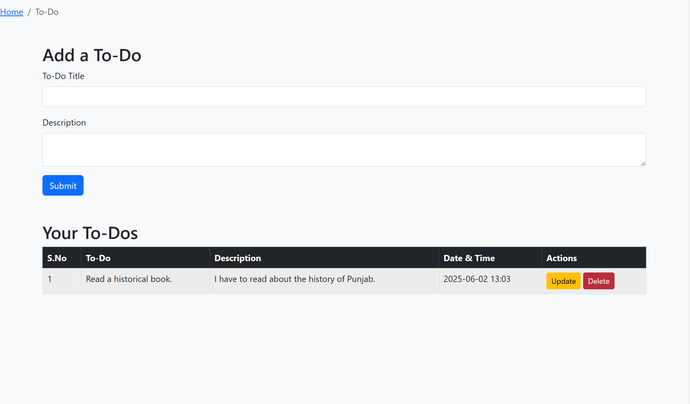

# 📝 ToDo App

A simple and clean task management app built using **Python** and **Flask**. Add, update, and delete your daily tasks with ease.

## 🚀 Features

- ✅ Add new tasks
- 🔁 Update existing tasks
- ❌ Delete completed tasks
- 💾 Stores tasks in SQLite database

## 🛠️ Tech Stack

- Python
- Flask
- SQLite
- HTML/CSS (basic)

## 💻 Run Locally

```bash
# Clone the repository
git clone https://github.com/Kaur7611/todo-app.git

# Navigate to the project folder
cd todo-app

# Run the app
python app.py


## 📸 Screenshots

### ✅ Task List Page


### ➕ Adding a Task


### ❌ Deleting or Updating a Task


